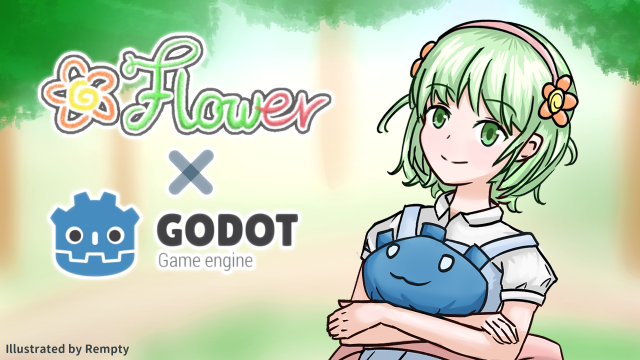

# 🌺 Flower


## **Flower-Godot** : a KrKr-like dialog system for Godot.
With Flower, you can not only setup your dialogs but also trigger functions (like **showing images, playing audios, executing customized C#...**) by plain text. 

You can create your content in a text file efficiently, easily integrate with your own game logic with default **Dialog** and **Button** features.

For extensibility, you can customize your own **commands** and **effects** with parameters for objects in Godot.

✨Supported for Godot4.x C# version.

[Godot for Unity](https://github.com/emptygamer/flower)

## Learn 🌺
- [Setup Flower](#setup)
- [Writing Content](#writing-content)
- [Commands](#commands)
- [Dialog](#dialog)
- [Button](#button)
- [Effects](#effects)
- [Variables](#variables)
- [Stop and Resume System](#stop-and-resume-system)
- [Async Commands](#async-commands) 
- [Settings](#settings)
- [Customized Event Functions](#customized-event-functions)
- [Contribute](#contribute)
---

## Setup Flower
1. Setup **Flower**, **[UniCoroutine](https://github.com/emptygamer/Godot-UniCoroutine)**, **Resources** into your Godot project.
2. Create **FlowerSystem**.
    ``` C#
    FlowerSystem flowerSys;
    flowerSys = FlowerManager.instance.GetOrCreateFlowerSystem("FlowerSample");
    flowerSys.SetupDialog();
    ```
3. Assign your dialog content via **plain text file** or **string list**.
    
    Load the "**start.txt**" file from Resources folder and execute.
    ``` C#
    flowerSys.ReadTextFromResource("res://Resources/start.txt");
    ```

    Assign content via a string list, that means you can generate content dynamically.
    ``` C# 
    flowerSys.SetTextList(new List<string>{"This is Flower System![w]"});
    ```

---
## Writing Content
You can write your dialog text in the plain text file, and calling  [keyword commands](#supported-keywords-in-the-text) for visual and auditory purpose and gameplay controlling.

### Calling keyword commands
Use brackets [*keyword*] (by defult) to set the keyword commands.
- If you want to print the brackets (*SPECIAL_CHAR_STAR*), just repeat it to make the words not a command. 
    - ex : ( [[w] -> print "[w]" )

#### Text commands use cases
```
    1.  text:   Hello![l]World![w]
        result: Hello!(wait for press)
        result: Hello!World!(wait for press)

    2.  text:   Hello![r]World![w]
        result: Hello!
                World!(wait for press)

    3.  text:   Hello![lr]World![w]
        result: Hello!(wait for press)
        result: Hello!
                World!(wait for press)
    
    4.  text:   Hello![w]World![w]
        result: Hello!(wait for press)
        result: World!(wait for press)
```

#### Visual & Auditory commands use cases
```
[audio,bgm,res://Resources/bgm.mp3,true,0,audioTransit_1_2000]
[image,fg1,res://Resources/character_image.png,0,0,10,spFadeIn_1000]
It's raining...
[particle,p1,res://Resources/rain_cpu_particle.tscn,0,-360]
[wait,1000]
[w]
[remove,p1]
It clears up.[w]
[remove,fg1,spFadeOut_1000]
```

---
## Commands
- [Command Parameters](./Docs/CommandParameters.md)
### Supported Commands in the text
|Type|Keywords|Commands|
|----------|----------|----------|
|💬|l|Wait for press.|
|💬|r|Change the line.|
|💬|lr|Wait for press, and change the line.|
|💬|w|Wait for press, and erase the text.|
|💬|c|Erase the text.|
|👀|[hide](./Docs/CommandParameters.md#hide)|Hide the text panel.|
|👀|[show](./Docs/CommandParameters.md#show)|Show the text panel.|
|📌|stop|Stop the system.|
|📌|resume|Resume the system.|
|💬|#VAR_NAME|Display the variable value.|
|⏱|[wait](./Docs/CommandParameters.md#wait)|Waiting.|
|🖼|[image](./Docs/CommandParameters.md#image)|Show the image.|
|🔊|[audio](./Docs/CommandParameters.md#audio)|Play the audio.|
|⚡️|[effect](./Docs/CommandParameters.md#effect)|Apply the object effect.|
|✨|[particle](./Docs/CommandParameters.md#particle)|Spawn a particle object.|
|🗑|[remove](./Docs/CommandParameters.md#remove)|Remove the scene object.|

### Customized Commands
#### 1. Define Command Functions
The Command Functions should follow the parameters : (List parameters). Parsing parameters and Executing.
``` C#
private void CustomizedFunction(List<string> _params)
{
    // Parse parameters.
    var resultValue = int.Parse(_params[0]) + int.Parse(_params[1]);
   GD.Print($"Hi! This is called by CustomizedFunction with the result of parameters : {resultValue}");
}
```
#### 2. Register Commands
Register this command and using **[UsageCase]** to call this customized command.
``` C#
flowerSys.RegisterCommand("UsageCase", CustomizedFunction);
```

---
## Dialog
### Setup Dialog
- DialogPrefab has to contain **CanvasGroup** component and **"DialogPanel/DialogText"** object with **Unity UI Text** component.
- Default will load **"DefaultDialogPrefab"** in resources folder.

``` C#
flowerSys.SetupDialog();
```

### Remove Dialog
``` C#
flowerSys.RemoveDialog();
```

### Next Dialog
``` C#
flowerSys.Next();
```

---
## Button
### Setup ButtonGroup
 - **ButtonGroup** is a container to contain **Buttons**, if you want to setup **Buttons**, you need to setup **ButtonGroup** first.
 - ButtonGroupPrefab need to contain **CanvasGroup** component and **"ButtonPanel"** object.
 - Default will load **"DefaultButtonGroupPrefab"** in resource folder.
 
``` C#
flowerSys.SetupButtonGroup();
```

### Setup Button
 - Default will load "**DefaultButtonPrefab**" in resource folder.
 - The **Button** object will be appeneded to **"ButtonGroup->ButtonPanel"**
``` C#
flowerSys.SetupButton("Button Demo.",()=>{
    // Your code here...
    flowerSys.Resume(); // Resume system.
    flowerSys.RemoveButtonGroup(); // Remove the button group.
});
```

---

## Effects
### **Supported effects**
- [Effect Parameters](./Docs/EffectParameters.md#effect-parameters)

|Effect Name|Target|Commands|
|----------|----------|----------|
|[spFadeIn](./Docs/EffectParameters.md#spfadein)|🖼CanvasItem|Set sprite alpha from 0 to current.|
|[spFadeOut](./Docs/EffectParameters.md#spfadeout)|🖼CanvasItem|Set sprite alpha from current to 0.|
|[moveTo](./Docs//EffectParameters.md#move)|🧊Node2D/3D|Move to the position (pixel).|
|[audioTransit](./Docs/EffectParameters.md#audiotransit)|🔊AudioStreamPlayer2D|Set the volume from current to value.|
|[canvasGroupTransit](./Docs/EffectParameters.md#canvasgrouptransit)|🖼CanvasItem|Set the alpha from current to value.|

### Customized Effects
#### 1. Define Effect Tasks
Define a IEnumerator task for rotating objects.
``` C#
IEnumerator CustomizedRotationTask(string key, Node obj, float endTime){
    if(obj is Node2D){
        var startRotationDegree = (obj as Node2D).RotationDegrees;
        var endRotationDegree = (obj as Node2D).RotationDegrees+180;
        yield return flowerSys.EffectTimerTask(key, endTime, (percent)=>{
            // Update function.
            var currentDegree = Mathf.Lerp(startRotationDegree, endRotationDegree, percent);
            (obj as Node2D).RotationDegrees = currentDegree;
        });
    }else if(obj is Node3D){
        var startRotationDegree = (obj as Node3D).RotationDegrees;
        var endRotationDegree = (obj as Node3D).RotationDegrees + new Vector3(0,0,180);
        yield return flowerSys.EffectTimerTask(key, endTime, (percent)=>{
            // Update function.
            var x = Mathf.Lerp(startRotationDegree.X, endRotationDegree.X, percent);
            var y = Mathf.Lerp(startRotationDegree.Y, endRotationDegree.Y, percent);
            var z = Mathf.Lerp(startRotationDegree.Z, endRotationDegree.Z, percent);
            (obj as Node3D).RotationDegrees = new Vector3(x, y, z);
        });
    }
    yield return null;
}
```
#### 2. Define Effect Functions
The **Effect Functions** should follow the parameters : *(string key, List<string> parameters)*. Parsing parameters, Extracting targets and Executing tasks. 
``` C#
private void EffectCustomizedRotation(string key, List<string> _params){
    try{
        // Parse parameters.
        float endTime;
        try{
            endTime = float.Parse(_params[0])/1000;
        }catch(Exception e){
            throw new Exception($"Invalid effect parameters.\n{e}");
        }
        // Extract targets.
        Node sceneObj = flowerSys.GetSceneObject(key);
        // Apply tasks.
        CoroutineSystem.instance.StartCoroutine(CustomizedRotationTask($"CustomizedRotation-{key}", sceneObj, endTime));
    }catch(Exception){
        GD.PushError($"Effect - CustomizedRotation @ [{key}] failed.");
    }
}
```
#### 3. Register Effects
Register this effect and using **customizedRotation_endTime** as the **EffectName**.
``` C#
flowerSys.RegisterEffect("customizedRotation", EffectCustomizedRotation);
```

---

## Variables
You can setup variables and using in **dialogs / commands / effects** with **VAR_CHAR (Default '#')**
### Setup Variables
``` C#
flowerSys.SetVariable("myInfo", "( ﾟдﾟ)");
flowerSys.SetVariable("myXPosition", "300");
flowerSys.SetVariable("myTransitTime", "2000");
```

### Display Variables in Text
```
Hello [#myInfo].
```
### As Command Parameters.
```
[image, img_1, test_image, #myXPosition, 0]
```
### As Effect Parameters.
```
[effect, img_1, spFadeOut_#myTransitTime]
```

---
## Stop and Resume System
### Stop
Use **[stop]** command or **.Stop()** function to pause the system.
### Resume
Use **.Resume()** function to resume the system.
``` C#
flowerSys.Resume();
```

---
## Async Commands
Async Commands can be executed asynchronously.
### Supported Async Commands
|Type|Keywords|
|----------|----------|
|🖼|async_image|
|🔊|async_audio|
|⚡️|async_effect|
|🗑|async_remove|

---
## Settings
### Position Coordinate
The center of the screen is **(x:0, y:0)**, and the unit is pixel.

### Screen Reference
The screen size is fixed, according to the project setting. (display/window/size/viewport)
for example, if your screen size is 1280/720, and scale to 1920/1080, the (0,0) is still mapped to (640,360). 

## Interacting with Scene Objects
### Get Scene Objects
Get the Scene Object that match the key.
``` C#
flowerSys.GetSceneObject("Scene Object Key")
```

### Query Scene Objects
Query the Scene Objects that match the regular expression pattern.
``` C#
flowerSys.QuerySceneObject("Regular Expression Pattern")
```

### Register Scene Objects
``` C#
flowerSys.RegisterToSceneObject("KEY", gameObject)
```

## Apply Global Settings to Scene Objects.
To apply global settings like Music & Sound Volumes, etc. 
### Apply to New Objects
You can use [Variables](#variables) to inject the setting values to [Commands](#commands) for **New Objects**.
### Apply to Exists Objects.
You can use [Query Scene Objects](#query-scene-objects) to query the target scene objects by Key, and apply the settings to **Exist Objects**.

---
## Customized Event Functions
### Text Updated
You can customized your own text updating function, for example, updating the text to **TextMesh**.

#### 1. You need to setup Dialog without default text updating function. 
``` C#
flowerSys.SetupDialog("DefaultDialogPrefab", false);
```
#### 2. Append your customized text updating function.  
``` C#
flowerSys.textUpdated += (object sender, TextUpdateEventArgs args)=>{
    // Your text updating function here...
    // GD.Print(args.text);
};
```
### Log Happened
You can customized your own log function, for example, only handling error logs and stop the game or storing the logs into log files. 

#### 1. Disable default logging function.
``` C#
flowerSys.isDefaultLogEnable=false;
```
#### 2. Append your customized logging function.
``` C#
flowerSys.logHappened += (object sender, LogEventArgs args)=>{
    GD.Print($"[{args.type}]{args.message}");
};
```

---
## Contribute
Do you want to improve Flower? Welcome :)!</br>
If you find some bugs, have any suggestion for features / improvements, feel free to create issues or send pull requests. (●'◡'●)
